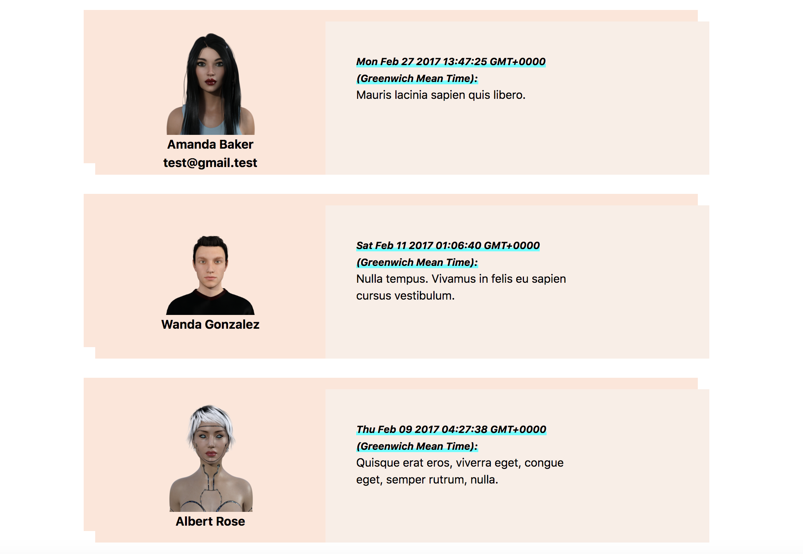

A simple React + Redux project to retrieve, render and manipulate data returned from an API.

## Commands

- **yarn start**: Runs the web application in developer mode
- **yarn test**: Executes Jest tests that have the `.test.js` extension

## Tasks

1. Render the list of messages from the redux store

2. Display the user's email when you hover over the message (using javascript).

3. Display the avatar of the user next to the message

4. Display and format the timestamp of the message to be human readable

5. Sort the messages by time

## Avatars

https://www.botlibre.com/
